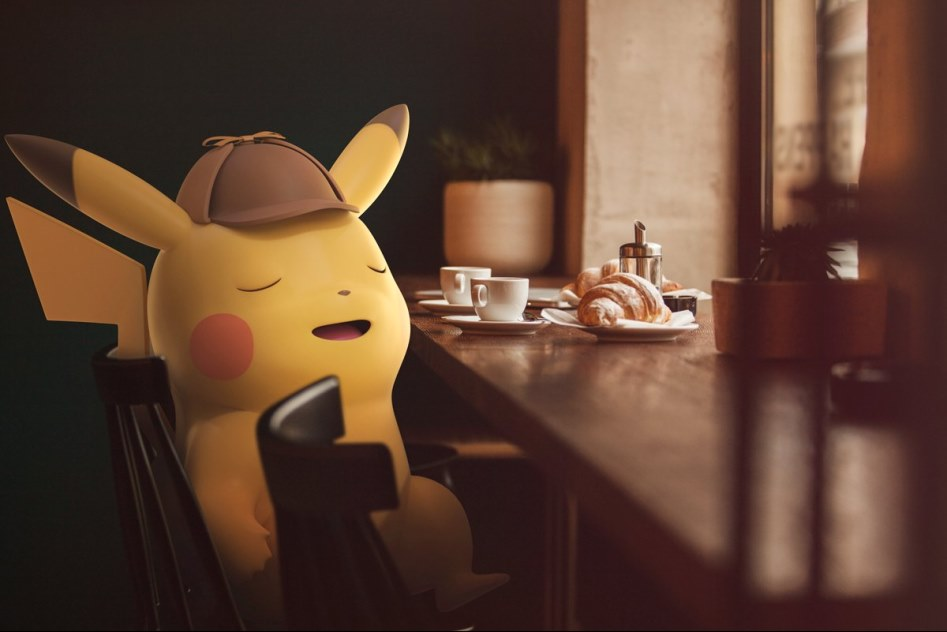

import Timeline from '../../components/Timeline';

Lorem ipsum dolor sit amet, consectetur adipiscing elit, sed do eiusmod tempor incididunt ut labore et dolore magna aliqua. Ut enim ad minim veniam, quis nostrud exercitation ullamco laboris nisi ut aliquip ex ea commodo consequat. Duis aute irure dolor in reprehenderit in voluptate velit esse cillum dolore eu fugiat nulla pariatur. Excepteur sint occaecat cupidatat non proident, sunt in culpa qui officia deserunt mollit anim id est laborum.

Lorem ipsum dolor sit amet, consectetur adipiscing elit, sed do eiusmod tempor incididunt ut labore et dolore magna aliqua. Ut enim ad minim veniam, quis nostrud exercitation ullamco laboris nisi ut aliquip ex ea commodo consequat. Duis aute irure dolor in reprehenderit in voluptate velit esse cillum dolore eu fugiat nulla pariatur. Excepteur sint occaecat cupidatat non proident, sunt in culpa qui officia deserunt mollit anim id est laborum.

<Timeline range="2019-05-01,2019-06-30" />

## Week 1

Far far away, behind the word mountains, far from the countries Vokalia and
Consonantia, there live the blind texts. Separated they live in Bookmarksgrove
right at the coast of the Semantics, a large language ocean. A small river named
Duden flows by their place and supplies it with the necessary regelialia.

## Week 2

The Big Oxmox advised her not to do so, because there were thousands of bad
Commas, wild Question Marks and devious Semikoli, but the Little Blind Text
didn’t listen. She packed her seven versalia, put her initial into the belt and
made herself on the way.

- This however showed weasel
- Well uncritical so misled
  - this is very interesting
- Goodness much until that fluid owl

When she reached the first hills of the **Italic Mountains**, she had a last
view back on the skyline of her hometown _Bookmarksgrove_, the headline of
[Alphabet Village](http://google.com) and the subline of her own road, the Line
Lane. Pityful a rethoric question ran over her cheek, then she continued her
way. On her way she met a copy.

## Week 3

But nothing the copy said could convince her and so it didn’t take long until a
few insidious Copy Writers ambushed her, made her drunk with
[Longe and Parole](http://google.com) and dragged her into their agency, where
they abused her for their projects again and again. And if she hasn’t been
rewritten, then they are still using her.

> Far far away, behind the word mountains, far from the countries Vokalia and
> Consonantia, there live the blind texts. Separated they live in Bookmarksgrove
> right at the coast of the Semantics, a large language ocean.

It is a paradisematic country, in which roasted parts of sentences fly into your
mouth. Even the all-powerful Pointing has no control about the blind texts it is
an almost unorthographic life One day however a small line of blind text by the
name of Lorem Ipsum decided to leave for the far World of Grammar.

## Week 4 ~ 5

The Big Oxmox advised her not to do so, because there were thousands of bad
Commas, wild Question Marks and devious Semikoli, but the Little Blind Text
didn’t listen. She packed her seven versalia, put her initial into the belt and
made herself on the way.

1.  So baboon this
2.  Mounted militant weasel gregariously admonishingly straightly hey
3.  Dear foresaw hungry and much some overhung
4.  Rash opossum less because less some amid besides yikes jeepers frenetic
    impassive fruitlessly shut

When she reached the first hills of the Italic Mountains, she had a last view
back on the skyline of her hometown Bookmarksgrove, the headline of Alphabet
Village and the subline of her own road, the Line Lane. Pityful a rethoric
question ran over her cheek, then she continued her way. On her way she met a
copy.

> The copy warned the Little Blind Text, that where it came from it would have
> been rewritten a thousand times and everything that was left from its origin
> would be the word "and" and the Little Blind Text should turn around and
> return to its own, safe country.

But nothing the copy said could convince her and so it didn’t take long until a
few insidious Copy Writers ambushed her, made her drunk with Longe and Parole
and dragged her into their agency, where they abused her for their projects
again and again. And if she hasn’t been rewritten, then they are still using
her. Far far away, behind the word mountains, far from the countries Vokalia and
Consonantia, there live the blind texts.

## Week 6

### Silent delightfully including because before one up barring chameleon

Separated they live in Bookmarksgrove right at the coast of the Semantics, a
large language ocean. A small river named Duden flows by their place and
supplies it with the necessary regelialia. It is a paradisematic country, in
which roasted parts of sentences fly into your mouth.

Even the all-powerful Pointing has no control about the blind texts it is an
almost unorthographic life One day however a small line of blind text by the
name of Lorem Ipsum decided to leave for the far World of Grammar. The Big Oxmox
advised her not to do so, because there were thousands of bad Commas, wild
Question Marks and devious Semikoli, but the Little Blind Text didn’t listen.

## Week 7

### Wherever far wow thus a squirrel raccoon jeez jaguar this from along

She packed her seven versalia, put her initial into the belt and made herself on
the way. When she reached the first hills of the Italic Mountains, she had a
last view back on the skyline of her hometown Bookmarksgrove, the headline of
Alphabet Village and the subline of her own road, the Line Lane. Pityful a
rethoric question ran over her cheek, then she continued her way. On her way she
met a copy.

## Week 8

### Slapped cozy a that lightheartedly and far

The copy warned the Little Blind Text, that where it came from it would have
been rewritten a thousand times and everything that was left from its origin
would be the word "and" and the Little Blind Text should turn around and return
to its own, safe country. But nothing the copy said could convince her and so it
didn’t take long until a few insidious Copy Writers ambushed her, made her drunk
with Longe and Parole and dragged her into their agency, where they abused her
for their projects again and again.

---

## Conclusion

Lorem ipsum dolor sit amet, consectetur adipiscing elit, sed do eiusmod tempor incididunt ut labore et dolore magna aliqua. Ut enim ad minim veniam, quis nostrud exercitation ullamco laboris nisi ut aliquip ex ea commodo consequat. Duis aute irure dolor in reprehenderit in voluptate velit esse cillum dolore eu fugiat nulla pariatur. Excepteur sint occaecat cupidatat non proident, sunt in culpa qui officia deserunt mollit anim id est laborum.
